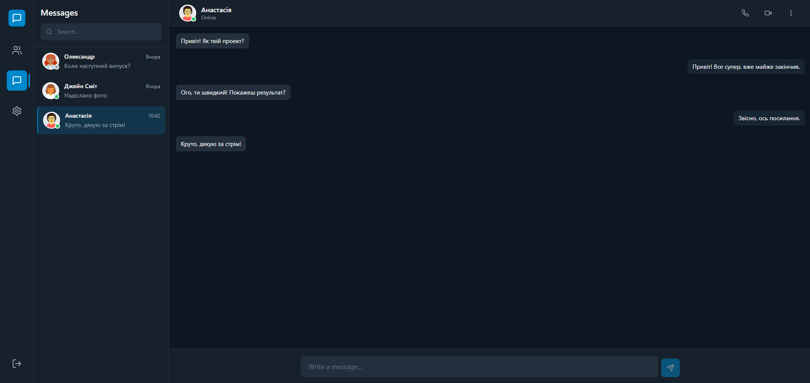

# LinkUp - Modern Messenger Application

A modern, feature-rich messaging application built with React and Vite, featuring a beautiful dark/light theme interface inspired by popular messaging platforms like Telegram and Discord.



## 📋 Table of Contents

- [Features](#-features)
- [Technologies](#-technologies)
- [Project Structure](#-project-structure)
- [Getting Started](#-getting-started)
- [Database](#-database)
- [UI/UX](#-uiux)
- [Development](#-development)
- [Future Improvements](#-future-improvements)

## ✨ Features

### 🔐 Authentication
- User login and registration
- Session persistence using localStorage
- User profile management

### 💬 Messaging
- Real-time chat interface
- Message history with timestamps
- Unread message counter
- Auto-scroll to latest messages
- Simulated auto-replies for demo purposes

### 👥 User Management
- User list with online/offline/idle status indicators
- Add/remove friends functionality
- Quick access to start conversations
- User profile cards with avatars

### ⚙️ Settings
- Profile customization
- Multi-language support (Ukrainian/English)
- Dark/Light theme switcher
- Notification preferences (placeholder)
- Privacy settings (placeholder)

### 🎨 Interface
- Modern, responsive design
- Smooth animations and transitions
- Telegram/Discord-inspired UI
- Customizable color schemes
- Tooltips and interactive elements

## 🛠️ Technologies

- **React 18.2.0** - UI library for building user interfaces
- **Vite 5.0.8** - Fast build tool and development server
- **Tailwind CSS 3.3.6** - Utility-first CSS framework
- **SQL.js 1.10.3** - SQLite database running in the browser
- **Lucide React 0.294.0** - Beautiful icon library
- **PostCSS** - CSS processing tool
- **Autoprefixer** - CSS vendor prefixing

## 📁 Project Structure

```
LinkUp/
├── src/
│   ├── App.jsx              # Main application component
│   ├── main.jsx              # Application entry point
│   ├── index.css             # Global styles and Tailwind imports
│   ├── db/
│   │   └── database.js       # SQL.js database operations
│   └── utils/
│       └── translations.js   # Multi-language translation system
├── index.html                # HTML template
├── package.json              # Dependencies and scripts
├── vite.config.js           # Vite configuration
├── tailwind.config.js       # Tailwind CSS configuration
├── postcss.config.js        # PostCSS configuration
└── Foto.png                  # Application screenshot
```

## 🚀 Getting Started

### Prerequisites

- Node.js (v16 or higher)
- npm or yarn package manager

### Installation

1. Clone the repository:
```bash
git clone <repository-url>
cd LinkUp
```

2. Install dependencies:
```bash
npm install
```

### Development

Start the development server:
```bash
npm run dev
```

The application will be available at `http://localhost:5173`

### Production Build

Build the project for production:
```bash
npm run build
```

The optimized files will be in the `dist/` directory.

### Preview Production Build

Preview the production build locally:
```bash
npm run preview
```

## 💾 Database

LinkUp uses **SQL.js** - a JavaScript port of SQLite that runs entirely in the browser. All data is stored locally in the browser's localStorage.

### Database Schema

- **users** - User profiles and information
- **chats** - Chat conversations
- **messages** - Individual messages in chats
- **current_user** - Currently logged-in user

### Key Features

- Automatic database initialization
- Seed data for demo purposes
- Persistent storage via localStorage
- Full CRUD operations for all entities

### Database Functions

- `initDatabase()` - Initialize or load existing database
- `getCurrentUser()` - Get logged-in user
- `getAllUsers()` - Retrieve all users
- `getAllChats()` - Get all chat conversations
- `getChatMessages(chatId)` - Get messages for a specific chat
- `addMessage()` - Add new message to chat
- `createChat()` - Create new chat conversation
- `deleteChat()` - Remove chat and all messages
- `registerUser()` - Register new user account

## 🎨 UI/UX

### Design Philosophy

The interface is inspired by modern messaging platforms with:
- Clean, minimalist design
- Intuitive navigation
- Smooth animations
- Responsive layout
- Accessible color schemes

### Theme Support

- **Light Theme** - Clean, bright interface
- **Dark Theme** - Easy on the eyes, modern look
- Automatic theme persistence
- Smooth theme transitions

### Components

- **Avatar** - User profile pictures with status indicators
- **Button** - Reusable button component with variants
- **Input** - Styled input fields with theme support
- **SidebarIcon** - Navigation icons with tooltips
- **LoginScreen** - Authentication interface

## 🔧 Development

### Code Organization

The project follows a component-based architecture:
- Reusable UI components
- Centralized state management
- Utility functions for database operations
- Translation system for internationalization

### Key Features Implementation

1. **State Management**: React hooks (useState, useEffect)
2. **Database Operations**: SQL.js with prepared statements
3. **Styling**: Tailwind CSS with custom utilities
4. **Icons**: Lucide React icon library
5. **Translations**: Custom translation system

## 🚧 Future Improvements

### Critical
- [ ] Refactor large components into smaller, reusable pieces
- [ ] Add form validation for login/registration
- [ ] Implement proper password hashing
- [ ] Add comprehensive error handling

### Enhancements
- [ ] Add TypeScript for type safety
- [ ] Implement unit and integration tests
- [ ] Add React Router for navigation
- [ ] Optimize database loading (lazy loading)
- [ ] Add search and filter functionality
- [ ] Implement file/image sharing
- [ ] Add accessibility features (ARIA labels)
- [ ] Implement real-time messaging with WebSockets
- [ ] Add message reactions and emoji support
- [ ] Implement message search functionality

### Security
- [ ] Input validation and sanitization
- [ ] Password hashing (bcrypt)
- [ ] XSS protection
- [ ] Database size limits
- [ ] Rate limiting

## 📝 Notes

This is a **demo version** of the application with mock data. For full production functionality, you would need to:
- Connect to a backend API
- Implement real-time messaging (WebSockets)
- Add user authentication server
- Set up cloud storage for media files
- Implement push notifications

## 📄 License

This project is open source and available for educational purposes.

## 👨‍💻 Author

Built with ❤️ using React and modern web technologies.

---

**Note**: The application stores all data locally in the browser. Clearing browser data will remove all chats and messages.
