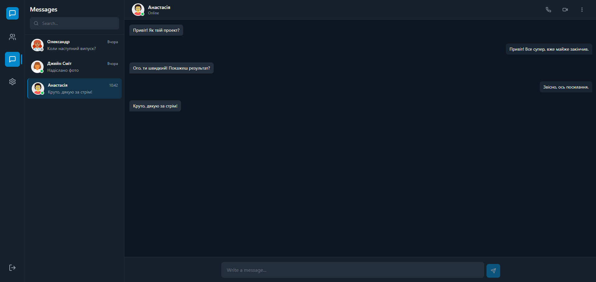

# LinkUp

LinkUp — локальний месенджер на `Vite + React + TypeScript + Tailwind CSS` з темами, роутингом та двомовністю (`uk`/`en`).



## Поточна структура проєкту

Проєкт приведено до єдиної структури React-додатку:

```text
src/
├── app/                 # App.tsx
├── pages/               # сторінки (Home.tsx)
├── components/          # UI-компоненти
├── features/            # feature-модулі
├── shared/              # ui, hooks, utils, constants, types
├── assets/              # іконки/зображення
├── i18n/                # i18n.ts + locales
│   └── locales/
│       ├── uk/common.json
│       └── en/common.json
├── router/              # router.tsx
├── styles/              # global.css + Tailwind
└── lib/                 # інфраструктурний код (db тощо)
```

## Що вже реалізовано за стандартами

- TypeScript у strict-режимі через `tsconfig.json`.
- i18n на `react-i18next` + `i18next-browser-languagedetector`.
- Мова за замовчуванням і fallback: `uk`.
- Роутинг у `src/router/router.tsx` з lazy loading (`React.lazy` + `Suspense`).
- Точка входу: `src/main.tsx`.
- Глобальні responsive/transition стилі в `src/styles/global.css`.
- Файл прикладу змінних середовища: `.env.example`.

## Технології

- `react`, `react-dom`
- `vite`, `typescript`
- `tailwindcss`, `postcss`, `autoprefixer`
- `react-router-dom`
- `i18next`, `react-i18next`, `i18next-browser-languagedetector`
- `sql.js`
- `lucide-react`

## Запуск проєкту

```bash
npm install
npm run dev
```

## Збірка

```bash
npm run build
npm run preview
```

## i18n

- Локалі зберігаються в:
  - `src/i18n/locales/uk/common.json`
  - `src/i18n/locales/en/common.json`
- Детекція мови:
  - `localStorage` (`linkup_language`)
  - `navigator.language`

## Роутинг

- Конфігурація маршрутів: `src/router/router.tsx`
- Підключення роутера: `src/app/App.tsx`
- Поточний маршрут: `/` -> `Home`

## Змінні середовища

```env
VITE_APP_NAME=LinkUp
```

## Примітка

Основна логіка інтерфейсу месенджера зараз інкапсульована у `src/App.jsx` і підключена через сторінку `src/pages/Home.tsx`. Це дозволяє рухатись поетапно: структура вже типізована та стандартизована, а деталізовану декомпозицію на дрібні TSX-компоненти можна виконувати без зміни UX.
