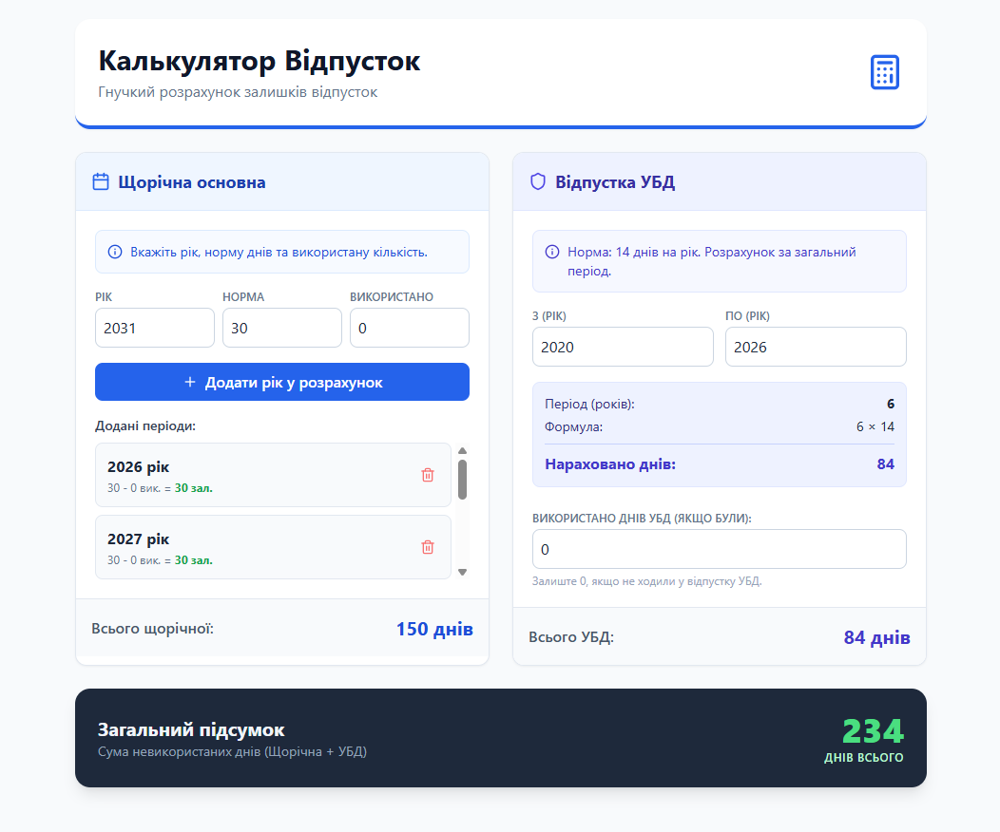

# 🏖️ Калькулятор Відпусток

**Гнучкий розрахунок залишків відпусток**

Веб-додаток для розрахунку невикористаних днів відпустки: щорічної основної та відпустки для учасників бойових дій (УБД).



## ✨ Функціональність

### 📅 Щорічна основна відпустка
- Додавання періодів по роках
- Вказівка норми днів та використаної кількості
- Автоматичний розрахунок залишків
- Підсумок по всіх доданих періодах

### 🛡️ Відпустка УБД
- Розрахунок за період (з року по рік)
- Норма: 14 днів на рік
- Врахування використаних днів УБД
- Автоматичний підрахунок нарахованих днів

### 📊 Загальний підсумок
- Сума невикористаних днів (Щорічна + УБД)
- Візуально виділений результат

## 🛠️ Технології

- **React 18** - UI бібліотека
- **Vite** - збірщик та dev-сервер
- **Tailwind CSS** - стилізація
- **Lucide React** - іконки

## 🚀 Встановлення та запуск

### Вимоги
- Node.js (версія 18 або вище)
- Yarn (менеджер пакетів)

### Кроки

1. Клонуйте репозиторій:
```bash
git clone <repository-url>
cd "Калькулятор відпусток"
```

2. Встановіть залежності:
```bash
yarn install
```

3. Запустіть dev-сервер:
```bash
yarn dev
```

4. Відкрийте браузер за адресою `http://localhost:5173`

### Збірка для продакшену

```bash
yarn build
```

Після збірки файли будуть в директорії `dist/`.

## 📝 Використання

1. **Щорічна відпустка:**
   - Вкажіть рік, норму днів та використану кількість
   - Натисніть "Додати рік у розрахунок"
   - Додайте стільки років, скільки потрібно
   - Видаліть непотрібні записи за допомогою іконки кошика

2. **Відпустка УБД:**
   - Вкажіть період (з року по рік)
   - Система автоматично розрахує кількість років та нараховані дні
   - Вкажіть використані дні УБД (якщо були)

3. **Результат:**
   - Загальний підсумок відображається внизу сторінки

## 📄 Ліцензія

Приватний проект
