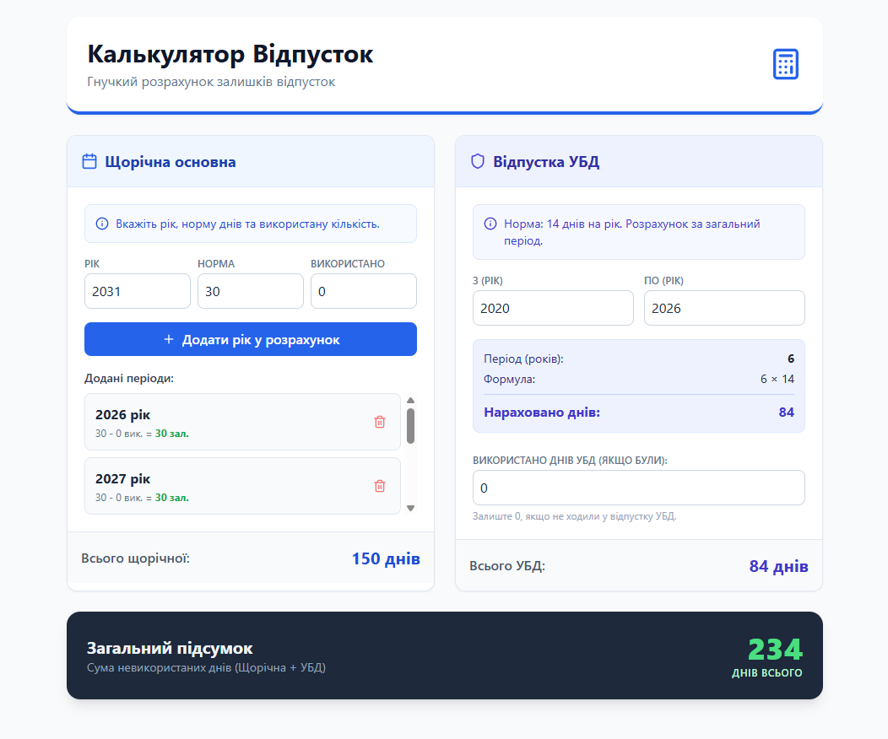

# Калькулятор відпусток

Актуалізований React-проєкт для розрахунку залишків днів відпусток:
- щорічна основна відпустка;
- відпустка УБД;
- загальний підсумок по всіх категоріях.



## Технологічний стек

- `react` 19
- `vite` 8
- `typescript` 6 (`strict` mode)
- `react-router-dom` 7 (централізований роутер у `src/router/router.tsx`)
- `tailwindcss` 4 + `@tailwindcss/vite`
- `react-i18next`, `i18next`, `i18next-browser-languagedetector`
- UI-шар у стилі `shadcn/ui` (базові компоненти у `src/shared/ui`)

## Підтримка мов

- Українська (`uk`) - мова за замовчуванням
- Англійська (`en`)

Локалі:
- `src/i18n/locales/uk/common.json`
- `src/i18n/locales/en/common.json`

## Структура проєкту

```text
src/
├── app/
├── pages/
├── components/
├── features/
├── shared/
│   ├── ui/
│   ├── hooks/
│   ├── utils/
│   ├── constants/
│   └── types/
├── assets/
├── i18n/
├── router/
├── styles/
└── lib/
```

## Вимоги до середовища

- Node.js `>=22`
- npm `>=10`

## Запуск локально

1. Встановити залежності:
```bash
npm install
```

2. Скопіювати змінні оточення:
```bash
cp .env.example .env
```

3. Запустити dev-сервер:
```bash
npm run dev
```

4. Відкрити в браузері: [http://localhost:5173](http://localhost:5173)

## Корисні скрипти

```bash
npm run dev
npm run typecheck
npm run build
npm run preview
```

## Що оновлено

- міграція з `jsx` на `TypeScript` (`strict`);
- перехід на актуальні стабільні версії екосистеми;
- централізований роутер з lazy page loading;
- підключено i18n з `uk/en`, fallback і detector;
- приведено структуру директорій до масштабованої;
- оновлено стильовий шар до Tailwind 4.
